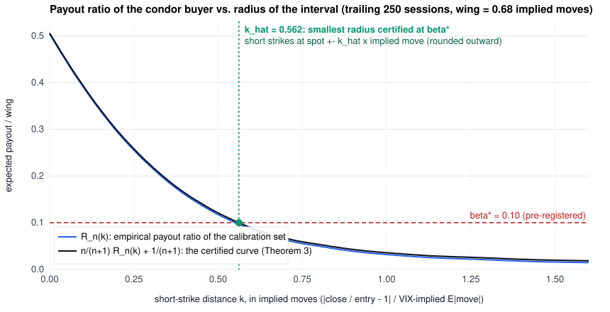

# Delphi: an evidence-based 0DTE options agent for Alpaca paper trading

*lablab.ai x Alpaca AI Trading Agents Hackathon, 28 Aug - 4 Sep 2026. Solo entry.*

**Every trade carries a finite-sample certificate: the market's price of an interval, read off the quote, against
the interval's certified cost, computed from history by conformal risk control. Sell only when the first exceeds the
second by the modelled cost of trading.** We do not claim a statistically detectable edge; we claim that bound, a risk
process that behaved exactly as specified, and a ledger anyone can check.

Delphi sells defined-risk, same-day-expiry iron condors on SPY inside pre-approved time windows, sized
so that the worst case of a session is 2 % of capital and the worst case of the whole hackathon is 6 %.
The short strikes are set by conformal risk control: the smallest interval at which the expected payout to
the buyer is certified, in finite samples, to be at most 10 % of the wing. The agent sells that interval only
when the option market pays at least 5 points of the wing more than the certified cost; by a three-line theorem
every such trade is then certified, in expectation and under the stated assumptions, not to lose after the
modelled round-trip cost (the Conformal Risk Control Condor, below; `docs/THEORY.md`). A large language model
classifies the regime and may veto; deterministic code owns every number, and a test proves the order is
byte-identical across different LLM outputs. Every decision, gate evaluation, order and fill is written to an
append-only audit log from which the post-session report, the public ledger, the determinism replay and the
leakage audit are computed; `scripts/reproduce.py` regenerates every number quoted here.

*Audited, not asserted.* On 2026-09-02 an independent literature audit (twelve topic reports, ~900 source cards,
35 load-bearing citations checked against primary sources) was run against this repository. Its corrections are
applied throughout, the strongest evidence against the design is quoted below rather than omitted, and every
pre-registered parameter changed after the first live cycle is listed with its reason in `docs/CONFIG_CHANGES.md`.

## Why this design (short version of `research/STATE_OF_THE_ART.md`)

| Finding | Evidence | Consequence |
|---|---|---|
| The index variance risk premium is real but ~2-3 % a year and has been shrinking: "over the past 15 years, option alphas have become indistinguishable from zero"; 0DTE premium selling has ~zero expected value after costs | Carr & Wu 2009 RFS; Bakshi & Kapadia 2003; Dew-Becker & Giglio 2025 (Chicago Fed WP 2025-17); Almeida, Freire & Hizmeri 2025; Beckmeyer, Branger & Gayda 2023; Vilkov 2026 (corrected, next row) | No edge is claimed. Positions are small, defined-risk, and the P&L is reported against benchmarks, not as alpha |
| Vilkov's 0DTE study reports a median realised variance risk premium of about 0.0011 % of the underlying from 10:00 ET to expiration, "difficult to monetize after realistic trading frictions"; its transaction-cost model was corrected by the author in August 2026 (half-spreads had been charged at 1/100 of their true size), after which no structure in it retains a materially positive net Sharpe ratio and the iron butterfly/condor bucket moves from -0.96 to -2.67 | Vilkov 2026, *0DTE Trading Rules* (SPXW, n = 1,319) and the author's `KNOWN-ISSUES.md` (github.com/vilkovgr/0dte-strategies, 2026-08) | We cite the corrected result against ourselves. The condor is not sold to harvest a premium; it is sold only when the market pays more than the certified cost (gate 31). Every Vilkov Sharpe figure in `research/F1` predates the correction and is superseded |
| The measurable half of the index-option premium is overnight: delta-hedged S&P 500 option returns to the buyer average about -0.7 %/day, "-1% per day" close-to-open (t = -12.0) and "positive, 0.3%" open-to-close (t = 2.6), concentrated in the afternoon; the intraday variance risk premium is "positive and often insignificant"; the writer's return sits in nontrading periods and is "essentially zero on average on other days" | Muravyev & Ni 2020 JFE (SPX/SPY, 2004-2013); Papagelis & Dotsis 2025 JFM (30-day indices, 2012-2022); Jones & Shemesh 2018 JF | Delphi holds no position overnight, so by construction it forgoes the component of the premium the literature can measure and does not claim an intraday premium; the only reason it ever sells is gate 31. Pre-registered in `docs/THEORY.md` section 8 with the 1DTE overnight roadmap |
| Cboe's own iron-condor index CNDR wins on about 62 % of days and still trails T-bills over 2018-2026 at midpoint marks with zero costs; a win rate describes the shape of a payoff, not its expectation | Cboe CNDR / BFLY / WPUT daily histories, computed in the 2026-09-02 audit (not yet independently replicated) | No win rate is reported as evidence of anything |
| Defined risk cuts the max drawdown by ~60 % vs naked premium | Cboe CNDR vs PUT 2006-2019; Augustin et al. 2021 | Every short leg has a bought wing in the same package order; no price stops: the wing is the stop |
| A condor is a short prediction interval whose payout is a monotone bounded loss of the radius; conformal risk control certifies the expected loss in finite samples and its online version keeps it under drift | Vovk et al. 2005; Angelopoulos, Bates, Fisch, Lei & Schuster ICLR 2024; Feldman, Ringel, Bates & Romano TMLR 2023; Gibbs & Candes 2021 | Short strikes = radius certified at beta* = 10 % of the wing on the ratio realised move / implied move; the level may only tighten after each session (`docs/THEORY.md`, `research/G`) |
| For a vertical spread, credit / width is the average risk-neutral survival probability across the spread (digital limit) | Breeden & Litzenberger 1978 J. Business | The market's price of our interval is read off the quote: trade only when it exceeds the certified payout by a cost margin, so E[payoff] >= margin x wing (gate 31) |
| Returns degrade as the short strikes move in: Cboe's ATM butterfly index BFLY trails its 20-delta condor index CNDR by about 1.5 bp/day and drew down 38 % over six years (audit computation); Vilkov's pre-correction width gradient pointed the same way | Cboe index histories (computed 2026-09-02 in the audit); Vilkov 2026 | The conformal radius may widen freely but is never tightened to satisfy the credit gate: if the market does not pay for the certified interval, there is no trade. Wings max($3, 0.5 % of spot); the fixed 1.10x rule ran on the pilot day and stays as the logged counterfactual |
| 0DTE quoted spreads are 1-2 ticks; a mid-price limit fills within a second 58-71 % of the time; percent-of-mid collars veto everything. Alpaca paper fills only marketable orders and simulates neither queue position nor price improvement | Fu, Li & Musto (SEC DERA); Alpaca paper-trading documentation; our pilot session 2026-09-02 | Order walking and price collars in ticks, on the package, never market orders; every rung is re-quoted at send time and reaches the live natural inside 60 s (`docs/CONFIG_CHANGES.md`) |
| LLM agents change behaviour when tickers are visible; the same agent on the same data produced returns from 5 % to 28 % across runs; 1,000 temperature-0 completions of one prompt gave 80 distinct outputs because inference kernels are not batch-invariant | Glasserman & Lin 2023; Koviazin, Mudarisov, Polyachenko & State 2026 (IC-AIF 2026, DOI 10.1145/3800973.3801029); Thinking Machines Lab 2025 | Tickers and dates masked; LLM emits enums only; temperature, top_p, top_k and seed pinned. Three votes from one model family are a self-consistency filter, not an independent ensemble: unanimity is an abstention trigger that raises the NO_TRADE rate, and the gate, not the vote, is the control |
| Gradient boosting and tabular foundation models do not beat a small logit on ~1,500 sessions where inference is possible | TabArena 2025; Grinsztajn et al. 2022; our `research/H` (21 configurations) | The regime model stays a twelve-coefficient logistic regression that can only shrink size; the negative result is reported |
| With 3 observations the Probabilistic Sharpe Ratio cannot reach 95 % at any performance level for fat-tailed returns | Bailey & Lopez de Prado 2014 | No Sharpe, win rate or annualised return is reported. Process metrics are |
| Non-farm payrolls on Fri 2026-09-04 08:30 ET; ISM services Thu 10:00 ET; Broadcom earnings Wed after close | BLS, ISM, company IR | Friday is a logged NO_TRADE day; Thursday entries after 10:15 ET; no single-name earnings trades |

## The Conformal Risk Control Condor (live from 2026-09-03)



*The whole rule in one picture: the buyer's expected payout as a fraction of the wing falls with the radius; the
black curve is the finite-sample-inflated version; where it first crosses the pre-registered `beta* = 0.10` is the
certified radius `k_hat`, and the short strikes go there. The market's price of the same interval is `credit / wing`;
the agent sells only if it exceeds `beta*` by the modelled cost. Regenerate: `python scripts/risk_curve.py`.*

1. **Score.** For every past session, `r = |close / price_10:30 - 1| / (VIX-implied expected absolute daily move)`.
   The unit is the same in history and live, so the calibration set and the live decision never disagree
   about what "one implied move" means.
2. **Payout as a loss.** A condor with short strikes at distance `k` (in implied moves) and wing `omega` pays its
   buyer `wing x min((r - k)+, omega) / omega`: a loss in [0, 1] that falls with `k` (Lemma 1). Controlling how
   *often* the close leaves the interval is the wrong target, because most breaches are partial; controlling
   the *expected payout* is the right one, and research/G measured the difference (break-even 75.7 %, not 83 %).
3. **Certified radius.** With the trailing 250 scores, `k_hat` is the smallest radius whose corrected empirical
   payout ratio `n/(n+1) R_n(k) + 1/(n+1)` is at most `beta* = 0.10`. Conformal risk control (Angelopoulos et
   al. 2024) then gives `E[payout] <= 0.10 x wing` under exchangeability of the scores (Theorem 3). Short
   strikes go at `spot +- k_hat x implied move`, rounded outward; wings `max($3, 0.5 % of spot)`, always bought.
   After every session, traded or not, an online level moves by `gamma (beta* - payout_t)` and may only
   tighten the radius; that gives a one-sided long-run bound that needs no distributional assumption (Theorem 4).
   Two honest remarks: the certificate is marginal over calibration and test session, while gate 31 conditions on
   `credit/wing`, which itself depends on the certified radius, so the certificate conditional on the gate opening is
   not implied (Theorem 3, remark v, with the four papers that name this problem); and with the realised payout ratio
   below `beta*` the online level sits at its ceiling, so the online layer is currently a one-sided safety valve with
   no effect on the interval, and the Theorem 4 slack over one year (0.224) is larger than `beta*` itself.
4. **The market's price of the interval.** `credit / wing`, read off the quote, is the integral of the
   risk-neutral survival function across the wing band (Lemma 2; Breeden & Litzenberger 1978). The expected
   payoff of one package is exactly `credit - E_P[payout]`.
5. **Gate 31.** Trade iff `credit / wing >= 0.10 + 0.05`, with the credit read at the expected fill (the natural;
   the mid is logged alongside). The 0.05 is the modelled round-trip cost of four legs: about $20 per contract at a
   $4 wing against $4-10 of one-tick friction, a cost margin, not a knob. Corollary: every trade is certified, in
   expectation and under exchangeability, not to lose after that modelled cost; a trade sitting exactly on the gate
   boundary has an expected profit of about its cost and no more. No academic source sets a credit-to-width floor;
   ours is an engineering choice sized as a friction budget (four SPY legs at one $0.01 tick are 1.33 % of a $3 wing,
   i.e. 8.9 % of a 0.15 credit; Cboe's own illustrative condor sits near 0.19).
6. **Kelly is an exhibit, not a controller.** The audit record carries the Kelly fractions with their standard
   error `(1+b)/b x se(p)` (Lemma 5); at these odds Kelly is negative or its error exceeds any prudent bet, so
   the 2 % cap binds, and the record shows that it binds.
7. **What is logged, every session, even with zero fills:** `beta*`, `beta_t`, `n`, `k_hat`, the strikes,
   `credit/wing` at the mid and at the expected fill with the per-side split, the empirical payout ratio at the
   strikes, the gap, the decision, and what the fixed 1.10x rule would have done. After the close: the realised
   ratio, the payout ratio, and the level updates. This ledger is the evaluation object of the write-up; it needs
   no statistical power.
8. **What three sessions can and cannot show.** Two test supermartingales are computed from the ledger and
   reported, never used to halt (`docs/evidence.md`, Theorem section 9): the risk process is anytime-valid evidence
   against the certificate (over the 618 back-filled sessions its running maximum is 2.66, anytime p-value 0.38: no
   evidence against), and the profit process is anytime-valid evidence for profitability, whose ceiling is
   arithmetic: three perfect sessions at credit/wing 0.20 cannot push the p-value below 0.51, and p <= 0.05 would
   need fourteen consecutive perfect packages. That is why no Sharpe ratio, win rate or annualised return appears
   anywhere in this repository.

Back-fill from history (`docs/conformal_backfill.md`, 618 calibrated sessions 2024-2026): realised payout ratio
0.079 against the 0.10 certificate, by year 0.070 / 0.079 / 0.090, all below the bound as Theorem 4 requires;
the fixed 1.10x rule's payout ratio drifts 0.119 / 0.113 / 0.073. The coverage track (research/G, kept as the
counterfactual) holds 0.806 against its 0.80 target. Two limits of that evidence: the whole calibration window
lies inside the 2024-2026 regime, and history cannot show whether the gate makes money, because there is no
option-price history on the basic plan, so the market's side of the ledger exists only live.
Theorems and proofs: `docs/THEORY.md`; evidence and the refutation of the width-changing variant:
`research/G_conformal_condor.md`.

**Where this sits in the literature (narrowed after the audit).** Conformal prediction has been applied to option
prices (Bastos 2024), to market-maker positions (Wisniewski, Lindsay & Lindsay, COPA 2020), to realised volatility from
implied volatility (Canete, COPA 2023) and, in the last three years, to trading decisions themselves: Conformal
Decision Theory (Lekeufack, Angelopoulos, Bajcsy, Jordan & Malik, ICRA 2024) calibrates a buy/short/abstain decision
against a loss budget in a geometric-Brownian-motion simulation, and Conformal Kelly (Ryan 2026) sizes equity positions
from a conformal interval. So "the first trading decision from a conformal interval" is not a claim we make. What we
could not find, and the audit could not find, is any work that selects option strikes by conformal risk control, treats
an option structure as the sale of a calibrated prediction interval, or gates the trade on the market's own
Breeden-Litzenberger price of that same interval. The economics of that comparison is old: Ait-Sahalia, Wang & Yared
(2001), Constantinides, Jackwerth & Perrakis (2009) and Faias & Santa-Clara (2017) all compare an estimated physical
distribution against option prices and trade the gap. Our contribution is the substitution: a finite-sample,
distribution-free bound on the expected payout ratio replaces the estimated physical probability, and the price of the
identical event is read off the quote rather than modelled.

## What was trained on history, and what it is allowed to do

`scripts/history_data.py` assembles 9,230 sessions (S&P 500 since 1975 and VIX since 1990 from Cboe;
SPY open/close from 2020-07 and 30-minute bars from 2024-01 from Alpaca IEX). `scripts/train_regime_model.py`
fits a standardised logistic regression that maps regime features known at the morning entry (VIX level,
VIX/VIX3M slope, realised-vs-implied volatility, overnight gap, calendar flags) to the probability that the
session ends inside the condor's short strikes. Validation is expanding-window, year by year, against the
unconditional base rate. The deployed model (`config/regime_model.json`) can only shrink the position size:
full at or above the historical tercile threshold, half below it, zero in the bottom decile. The same dataset
gives the random-entry Monte Carlo null against which the campaign P&L is reported as a percentile.

Disclosed, not hidden (`docs/regime_model_report.md`, `research/H_tabular_ml_small_data.md`): on the exact
10:30-to-close horizon the logit is worse than a constant (two year-blocks, no inference possible); on the
close-to-close horizon with fifteen blocks it is the best single model. XGBoost, LightGBM, a logit+XGBoost
average, TabPFN v2 and TabICL v2 were run under the identical protocol (7 families x 3 horizons = 21
configurations): the foundation models win only where nothing can be measured and lose where it can. The
constant-credit assumption of the back-test (17 % of the wing) invalidates any conclusion that changes the
interval width; the live agent reads the credit off the quote instead. No third-party model weights ship
with the agent (TabICL v2 is BSD-3, TabPFN v2 carries an attribution clause, TabPFN 2.5+ is non-commercial).

## Architecture

```
Alpaca data (alpaca-py) + Cboe VIX/VIX3M/VIX1D + Alpaca news
        |
        v
Regime module (LLM, Featherless)  -->  enums only: VOL_REGIME, TREND, EVENT_RISK, FAMILY, VETO
        |
        v
Strategy module (code): radius certified by conformal risk control -> symmetric condor -> credit/wing from the quote
        |
        v
Sizing (code): 2 % / 6 % max-loss budget, Grossman-Zhou taper, VIX/VIX3M, VIX1D and regime-model multipliers
        |
        v
Gate engine (code): 30 gates from SEC 15c3-5, MiFID II RTS 6, FINRA 15-09, Knight Capital + gate 31 (credit/wing >= beta* + margin)
        |
        v
Critic (LLM): PASS / REDUCE / BLOCK, never enlarge
        |
        v
Execution (code): mleg limit ladder in ticks, re-quoted per rung -> book -> reconciliation -> flatten by 15:15 ET -> level update after the close
        |
        v
Audit log (JSONL) -> journal (LLM prose from facts) -> post-session report -> determinism + leakage audits
```

* **Alpaca Trading API** (alpaca-py): account, clock, option chain snapshots, multi-leg orders, positions; IEX bars for the conformal scores.
* **Alpaca CLI**: `scripts/status.sh` is the independent monitoring and reconciliation path (JSON output to `logs/`).
* **Alpaca MCP server**: used by the operator (Claude Code) to inspect the account and chains during development and in the demo.
* **Featherless.ai**: open-weight models (`deepseek-ai/DeepSeek-V3.2` for regime and critic, `Qwen/Qwen3-30B-A3B-Instruct-2507` for the journal) through the OpenAI-compatible endpoint.

## Run

```bash
python -m venv .venv && .venv/Scripts/pip install -r requirements.txt   # Windows; use bin/ on Unix
cp .env.example .env        # fill in paper keys and the Featherless key; never commit .env
.venv/Scripts/python -m pytest -q             # 37 tests incl. a fake end-to-end cycle, the byte-identical-order test, the re-quoting ladder and the conformal arithmetic
python scripts/history_data.py                # assemble state/history/daily.csv (Cboe + Alpaca IEX)
python scripts/conformal_backfill.py --force  # replay both online tracks through history -> state/conformal.json, docs/conformal_backfill.md
python scripts/reproduce.py                   # recompute every number quoted in the docs and print MATCH / MISMATCH
python scripts/evidence.py                    # anytime-valid evidence: risk and profit e-processes, evidence ceiling -> docs/evidence.md
python scripts/risk_curve.py                  # the payout-ratio curve with beta* and k_hat -> docs/risk_curve.svg
python scripts/preflight.py --at 10:20        # live pre-flight: interval, P vs Q, sizing, every gate; sends nothing
AGENT_DRY_RUN=true .venv/Scripts/python -m agent.main   # logs would-be orders without sending
.venv/Scripts/python -m agent.main            # live paper loop (updates alpha after the close by itself)
python scripts/conformal_update.py            # end-of-session alpha update if the agent was not running at 16:10 ET
python scripts/kill.py --flatten              # kill switch: cancel all, flag, flatten with limit orders
python scripts/report.py --session 2026-09-03 --out docs/report_2026-09-03.md
python scripts/dashboard.py                   # docs/dashboard.html incl. the P-vs-Q ledger
python scripts/publish_dashboard.py --push    # docs/index.html + docs/ledger.json for GitHub Pages, committed and pushed
python scripts/determinism_check.py --k 5     # replay the last regime prompt, entropy in bits
python scripts/leakage_audit.py               # masked vs unmasked decision, re-identification rate
```

Paper trading is enforced: the agent refuses to start unless `ALPACA_PAPER_TRADE=true`.

## Repository map

* `config/` risk limits (immutable at runtime), strategy parameters incl. the pre-registered `conformal` block, event calendar, trained regime model
* `agent/core` models, clock, config, strategy, sizing, conformal (risk-control radius, online levels, P-vs-Q ledger), regime model, Black-Scholes fallback; `agent/gates` the gate engine; `agent/llm` provider, anonymiser, regime, critic, journal; `agent/execution` orders, flatten, reconciliation; `agent/reporting` audit log
* `scripts/` history assembly, model training, conformal back-fill and update, pre-flight, kill, flatten, status (CLI), report, dashboard, determinism check, leakage audit
* `research/` five literature reports, two source-reading reports, the conformal-condor study (G), the tabular-ML study (H) with their experiments, and the synthesis with a 50-entry bibliography
* `docs/` theory note (definitions, theorems, proofs), incident runbook, the dated log of configuration changes, regime model report, conformal back-fill, the evidence report (e-processes, ceiling), claims file for `reproduce.py`, session reports, write-up, submission text, slides
* `lean/` Lean 4 + Mathlib machine-check of the deterministic lemmas (see its README for what is and is not proved)

## License

MIT.
